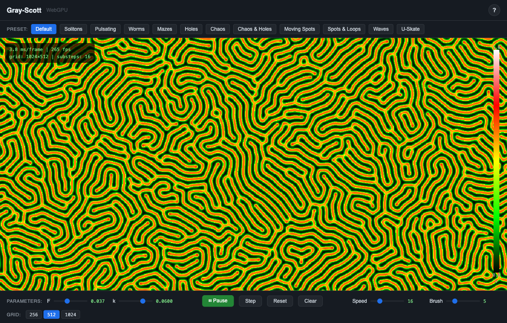
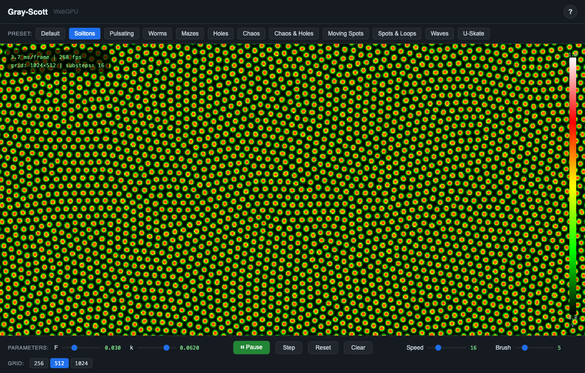
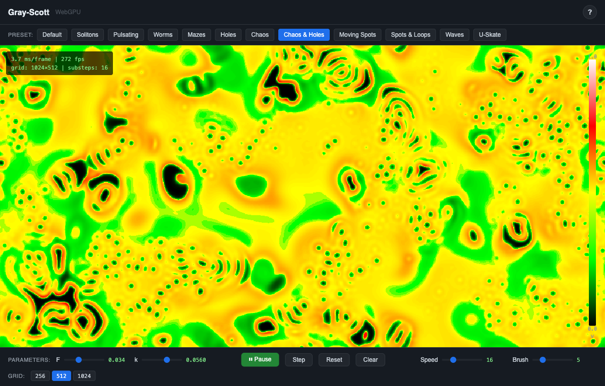

<div align="center">

# Gray-Scott

**Real-time reaction-diffusion patterns in your browser, powered by WebGPU**

Watch Turing patterns emerge — spots, mazes, worms, and chaos — all computed on the GPU at interactive frame rates. Paint strokes to seed patterns, tune parameters live, and explore 12 distinct behavioral regimes.

[](https://www.w3.org/TR/webgpu/)
[](https://fastapi.tiangolo.com/)
[](#)

</div>



<p align="center">
  
  
</p>

## Features

- **GPU-accelerated solver** — FTCS (Forward-Time Centered-Space) with 5-point Laplacian, periodic boundaries, all in a single WGSL compute shader
- **12 curated presets** — Spots, solitons, worms, mazes, holes, chaos, waves, and more from the Pearson classification
- **Aspect-ratio-aware grid** — Grid width adapts to your browser window so patterns remain undistorted
- **Brush painting** — Click and drag to seed activator chemical onto the field
- **Live parameter tuning** — Drag F/k sliders or use vim-style keyboard shortcuts (J/K for feed rate, H/L for kill rate) for fine-grained control
- **Interactive guide** — Accordion-style explainer covering the Gray-Scott equations, Turing instability, and all controls
- **Adjustable grid** — 256, 512, or 1024 vertical resolution with configurable simulation speed

## Quick Start

**With Docker** (no Python installation required):

```bash
git clone https://github.com/palsagar/webgpu-gray-scott.git
cd webgpu-gray-scott
docker build -t gray-scott .
docker run -p 8000:8000 gray-scott
```

**With Python**:

```bash
git clone https://github.com/palsagar/webgpu-gray-scott.git
cd webgpu-gray-scott
uv run uvicorn server:app --port 8000
```

Open `http://localhost:8000` in Chrome 113+ (WebGPU required).

## How It Works

The solver implements the Gray-Scott reaction-diffusion system:

- **du/dt = Du∇²u - uv² + F(1 - u)**
- **dv/dt = Dv∇²v + uv² - (F + k)v**

Two chemicals on a 2D grid: U (substrate, fed at rate F) and V (activator, removed at rate k). The autocatalytic reaction U + 2V → 3V drives pattern formation when the activator diffuses slower than the substrate (Du > Dv) — a Turing instability.

The numerical method is FTCS with dt=1.0, dx=1.0, Du=0.2097, Dv=0.105. A single WebGPU compute shader dispatches an 8×8 workgroup grid over the domain. Ping-pong buffer pairs avoid read/write hazards. All data stays on the GPU — the CPU only reads back the V field for colormap visualization via async staging buffers.

For detailed technical documentation, see the **[Documentation Hub](docs/README.md)**.

## Project Structure

```
server.py                  # FastAPI server (~30 lines)
static/
  index.html               # UI shell, welcome modal, guide
  css/style.css             # Dark theme
  js/
    main.js                 # Entry point, animation loop
    solver.js               # GPU buffer management, compute dispatch
    renderer.js             # 2D canvas rendering, colormap
    interaction.js           # Mouse brush painting
    presets.js               # 12 preset configurations
    ui.js                    # DOM bindings, sliders, keyboard shortcuts
  shaders/
    gray-scott.wgsl          # FTCS reaction-diffusion compute shader
  colormaps/
    viridis.png              # 256x1 colormap LUT (black-green-yellow-red-white)
```

## Browser Requirements

WebGPU support required: Chrome 113+, Edge 113+, or Firefox Nightly with `dom.webgpu.enabled` flag.

## Keyboard Shortcuts

| Key | Action |
|-----|--------|
| `P` | Play / Pause |
| `M` | Step one frame |
| `R` | Reset to current preset |
| `C` | Clear field (blank canvas) |
| `J` / `K` | Decrease / increase F (feed rate) |
| `H` / `L` | Decrease / increase k (kill rate) |

## Background

After building [FlowLab](https://github.com/palsagar/webgpu-fluid-solver) — a real-time Navier-Stokes solver in the browser — the natural next step was to explore another classic PDE system through the same lens. The Gray-Scott reaction-diffusion model is in many ways the perfect complement: where fluid dynamics requires a staggered MAC grid, pressure projection, and semi-Lagrangian advection, Gray-Scott needs just a single explicit update step with a 5-point Laplacian. The physics are simpler, but the phenomenology is richer — the (F, k) parameter plane contains an extraordinary variety of self-organizing patterns, from stable solitons to spatiotemporal chaos, all emerging from the same two-line equation.

The architecture carries over directly from FlowLab: vanilla ES modules orchestrating WebGPU compute shaders, FastAPI serving static files, async staging buffers for GPU→CPU readback, and a preset system that lets users explore the parameter space without touching code. What's new is the brush painting interaction — instead of dragging obstacles through a flow, you seed chemical activator and watch Turing patterns crystallize from your strokes.
