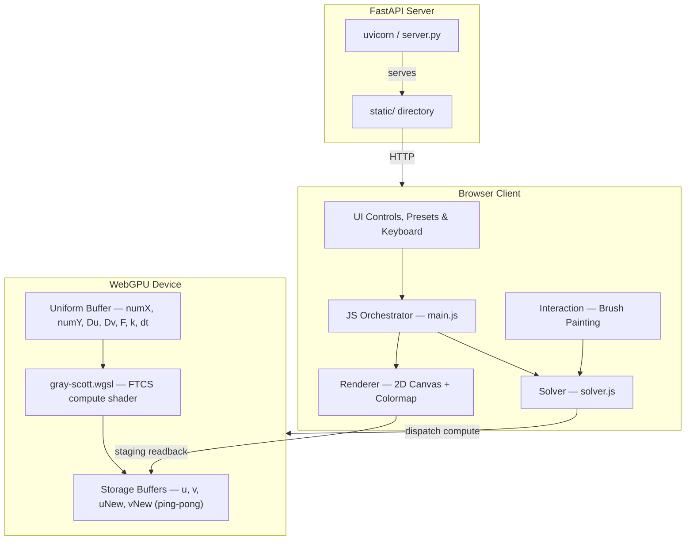

# Gray-Scott — Technical Documentation

Real-time Gray-Scott reaction-diffusion simulation running entirely on the GPU via a single WebGPU compute shader. The solver uses an explicit FTCS (Forward-Time Centered-Space) scheme with a 5-point Laplacian and periodic boundary conditions. A 2D canvas renders the V (activator) field through a colormap LUT, with async GPU→CPU staging buffer readback.

## System Overview



## Documentation

| Document | Description |
|----------|-------------|
| [Reaction-Diffusion Science](reaction-diffusion.md) | Gray-Scott equations, Turing instability, behavioral regimes in the (F, k) plane |
| [Numerical Methods](numerical-methods.md) | FTCS scheme, stability analysis, alternative methods, assumptions & limitations |
| [System Architecture](architecture.md) | Module graph, frame loop, GPU pipeline, rendering, interaction, presets, UI |

## Quick Start

```bash
uv run uvicorn server:app --port 8002
```

Open `http://localhost:8002` in Chrome 113+ (WebGPU required).
